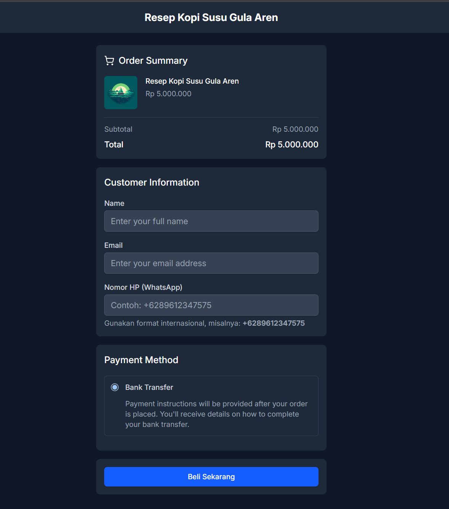
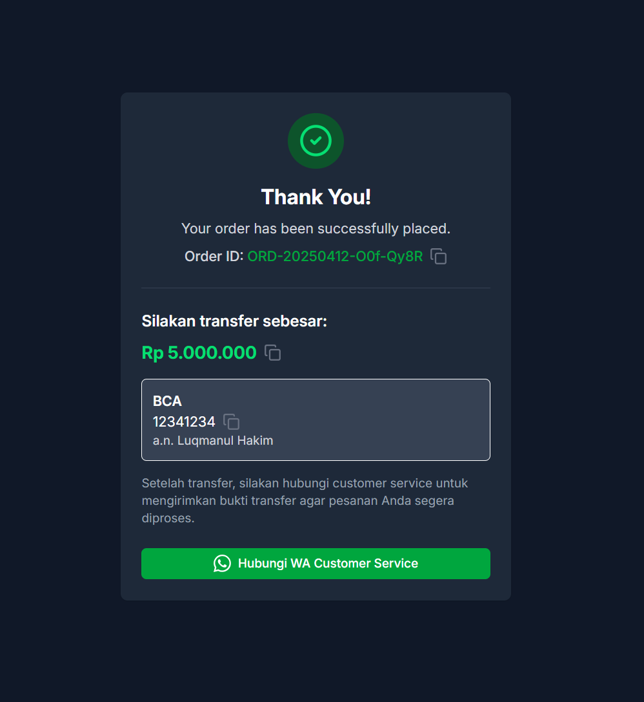

# 🧾 Simulasi Checkout Pelanggan

Halaman checkout di BikinLanding.page memudahkan pembeli untuk melakukan pemesanan dan pembayaran secara manual melalui transfer bank.

Berikut panduan lengkap simulasi proses checkout dari sisi pelanggan:

---

## 🧍 1. Isi Formulir Checkout

Pelanggan akan melihat tampilan seperti ini saat mengunjungi halaman checkout:

### ✅ Informasi yang harus diisi:

- **Name** – Masukkan nama lengkap pembeli
- **Email** – Pastikan email aktif untuk menerima notifikasi
- **Nomor HP (WhatsApp)** – Masukkan nomor WhatsApp dalam format internasional  
  Contoh: `+6289612347575`

> Pastikan nomor WhatsApp benar karena akan digunakan untuk komunikasi selanjutnya setelah pembayaran.

---

## 🏦 2. Pilih Metode Pembayaran

Saat ini (versi MVP), metode yang tersedia adalah:

- **Transfer Bank Manual**  
  Instruksi transfer akan muncul setelah tombol “Beli Sekarang” ditekan.

---

## ✅ 3. Konfirmasi Pesanan Berhasil

Setelah pelanggan menekan tombol **Beli Sekarang**, mereka akan diarahkan ke halaman konfirmasi seperti berikut:

### Halaman ini akan menampilkan:

- **Order ID**
- **Total yang harus ditransfer**
- **Rekening tujuan (Bank, No. Rekening, dan Nama Pemilik)**
- Tombol WhatsApp untuk langsung menghubungi penjual

---

## 📩 4. Kirim Bukti Transfer via WhatsApp

Setelah melakukan transfer:

- Pelanggan klik tombol **Hubungi WA Customer Service**
- Kirimkan bukti transfer ke WhatsApp toko Anda
- Pesanan akan diproses manual oleh penjual

---

## 📝 Tips untuk Penjual

- Pastikan Anda mencantumkan informasi rekening dengan jelas dan sesuai
- Cek WhatsApp Anda secara berkala untuk konfirmasi pembayaran
